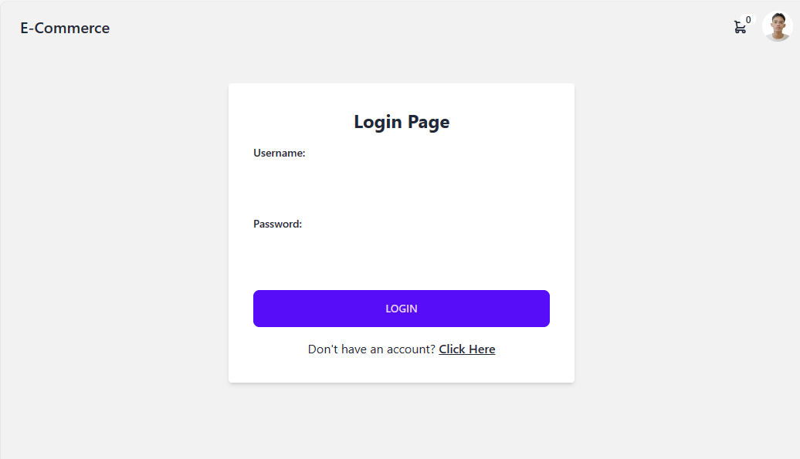
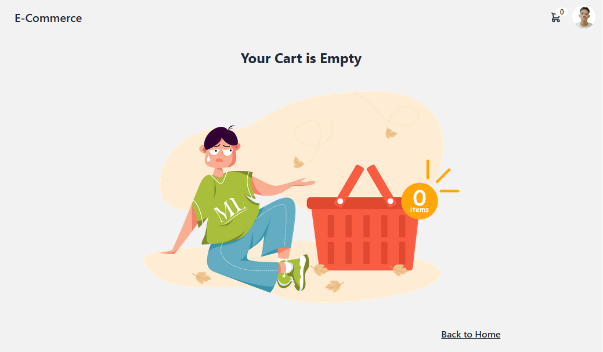
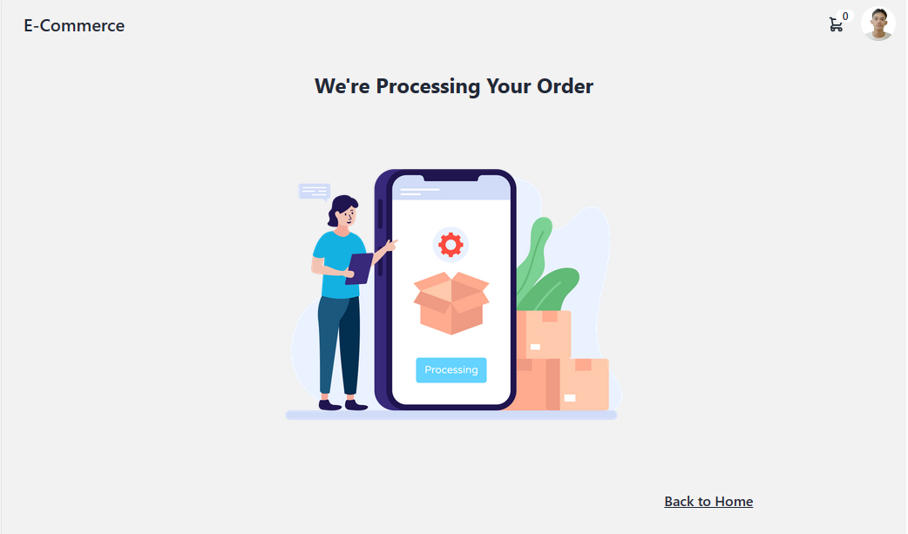

# PHP-Shop-Website

An E-commerce website built using vanilla PHP, MySQL, TailwindCSS, and JavaScript.

## Installation

To install and run this project on your local machine, follow these steps:

1. Clone the repository:
   ```bash
   git clone https://github.com/jnale-hub/PHP-Shop-Website.git
   ```

2. Navigate to the project directory:
   ```bash
   cd PHP-Shop-Website
   ```

3. Use XAMPP or a similar solution for running a local PHP server and MySQL database.

4. Create a MySQL database and import the `database.sql` file. Make sure to configure your database connection settings in the project.

5. Start the development server:
   - If using XAMPP, start Apache and MySQL services.
   - If running a local PHP server, configure your server to serve the project directory.

6. Access the project in your web browser by visiting `http://localhost/PHP-Shop-Website` or the appropriate URL based on your server configuration.

## Project Structure

The project directory structure is organized as follows:

- `css/`: Contains CSS styles and TailwindCSS classes.
- `js/`: Includes JavaScript files.
- `templates/`: Stores template files.
- `include/`: Contains PHP files for server-side logic.
- `assets/`: Holds static assets like images and icons.

## Features

This E-commerce website includes the following features:

- User registration and login.
- Browsing and adding products to the cart.
- Viewing and managing the cart.
- Checkout and order processing.

## Usage and Screnshots

1. Register an account using `register.php`.

2. Log in with your credentials using `login.php`.

3. Explore and shop for products on the `index.php` page.

4. Add products to your cart.

5. Review and manage your cart on the `cart.php` page.

6. Proceed to checkout for order processing.


## License

This project is licensed under the [MIT License](LICENSE).
